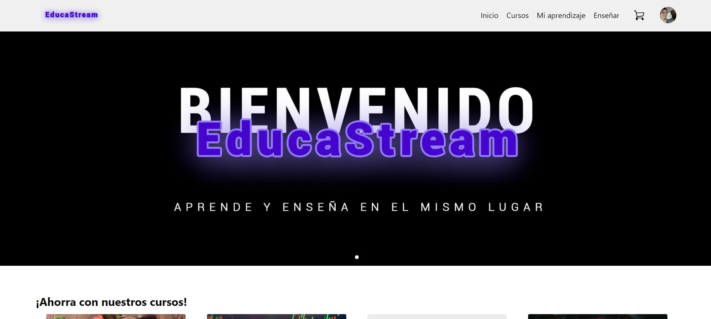
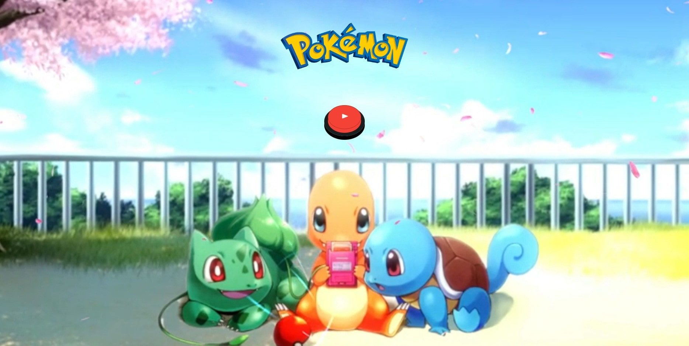
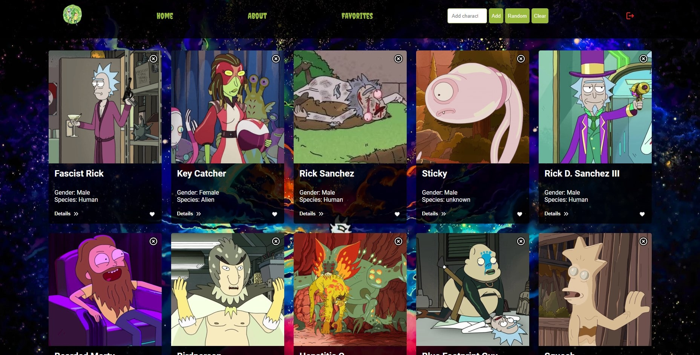

## ¡Hola! 👋

Soy Lucas, un **Junior Full Stack Developer** apasionado por la tecnología y el aprendizaje constante. Mi experiencia abarca tecnologías tanto en el **Front-End** como en el **Back-End**, y también tengo habilidades en diseño y testing.

### 📫 Cómo contactarme:

- Email: lucastamburlini@gmail.com
- Celular: +54 9 3442 644674
- LinkedIn: [linkedin.com/in/lucasgabrieltamburlini](https://www.linkedin.com/in/lucasgabrieltamburlini)
- Portafolio: [lucastamburlini.vercel.app](https://lucastamburlini.vercel.app)
- CV: [Curriculum Vitae](https://drive.google.com/file/d/1Dp-hglqaP6UOjco4-ca6uZck3eh3OQPZ/view?usp=sharing)

### 🛠️ Herramientas y Tecnologías:

| **Front-End**       | **Back-End**   | **Base de Datos** | **Diseño**        | **Metodologías Ágiles** | **Testing**            | **Herramientas Adicionales** |
| -------------------- | -------------- | ----------------- | ------------------ | ------------------------ | ----------------------- | ---------------------------- |
| - HTML               | - Node.js      | - MongoDB         | - Adobe Photoshop   | - Scrum                 | - Testing Exploratorio | - Jira                      |
| - CSS                | - Express      | - PostgreSQL      | - Canva             |                        | - Metodologías Convencionales | - Postman                |
| - JavaScript         |                |                   | - CorelDRAW         |                        |                         | - Trello                    |
| - React              |                |                   | - Figma             |                        |                         |                            |
| - Sass               |                |                   |                    |                        |                         |                            |
| - Bootstrap          |                |                   |                    |                        |                         |                            |
| - Material UI        |                |                   |                    |                        |                         |                            |
| - Redux              |                |                   |                    |                        |                         |                            |

|  |  |  |
|---|---|---|

